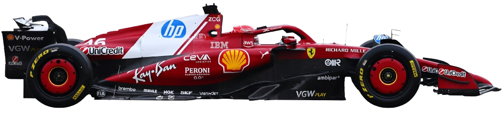

  

<h1 align="center">🏎️ F1 Ferrari – GSAP Powered Experience</h1>

  A cinematic, scroll-driven Ferrari F1 website built to explore advanced <b>GSAP animations</b>,
  smooth video scrubbing, and modern frontend performance techniques.

  <a href="#features">Features</a> •
  <a href="#tech-stack">Tech Stack</a> •
  <a href="#what-i-learned">What I Learned</a> •
  <a href="#setup">Setup</a>

---

## 🔥 Project Overview

This project is a **Ferrari F1–inspired interactive website** focused on **motion, performance, and storytelling**.

The goal wasn’t just visual design —  
it was to **deeply understand GSAP**, ScrollTrigger behavior, and how **video + scroll animations** work in real-world production scenarios.

---

## ✨ Features

- 🎬 **Scroll-controlled hero video** (frame-by-frame scrubbing)
- 📱 **Responsive video strategy**
  - Landscape video for desktop
  - Portrait video for mobile devices
- 🧲 **Pinned hero section** with smooth release
- 🧩 **GSAP SplitText animations** for headings & subtitles
- ⚡ **Ultra-smooth animations** with optimized video encoding
- 🎨 Ferrari-inspired typography & gradients
- 🚀 Performance-focused (GPU hints, scrub smoothing)

---

## 🛠️ Tech Stack

| Category   | Tools                           |
| ---------- | ------------------------------- |
| Frontend   | React, Vite                     |
| Styling    | Tailwind CSS                    |
| Animations | GSAP, ScrollTrigger, SplitText  |
| Video      | FFmpeg (manual optimization)    |
| Deployment | Vercel                          |

---

## 📚 What I Learned (Most Important Part)

This project was a **hands-on GSAP learning journey**, not just a UI build.

### 🎯 GSAP Concepts Learned

- `gsap.timeline()` for sequencing animations
- `ScrollTrigger` pinning & scrubbing
- `scrub: 1` vs `scrub: true`
- Preventing pin jumps with `anticipatePin`
- Managing multiple ScrollTriggers safely
- Splitting text animations using `SplitText`
- Waiting for fonts before splitting text

---

### 🎥 Scroll-Based Video Learnings (Advanced)

- Why video **lags** during scroll (encoding issue, not GSAP)
- Optimizing video for scroll:
  - Constant FPS
  - Keyframe every frame
  - Removing audio
- Why `<video><source media>` is **load-time responsive**
- Why DevTools resize ≠ real device behavior
- Desktop vs Mobile video strategy (real production approach)

> This project taught me that **animation smoothness is 70% preparation, 30% code**.

---
